<div align="center">

# Smart Wafer Demand Prediction System

### **AI-Powered Semiconductor Demand Intelligence & Fab Capacity Analytics Platform**

[](https://www.python.org/)
[](https://flask.palletsprojects.org/)
[](https://nextjs.org/)
[](https://react.dev/)
[](https://www.typescriptlang.org/)
[](https://tailwindcss.com/)
[](https://catboost.ai/)
[](https://www.mysql.com/)

<br />

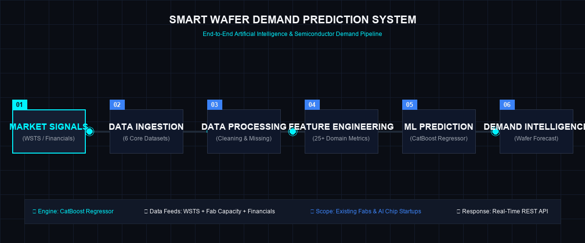

*End-to-end artificial intelligence pipeline predicting monthly silicon wafer demand (3nm to 28nm nodes) for leading semiconductor foundries, IDMs, and emerging AI hardware startups.*

</div>

---

## 📋 Table of Contents

- [Executive Summary & Product Overview](#-executive-summary--product-overview)
- [Why This Project?](#-why-this-project)
- [System Architecture](#-system-architecture)
- [Animated System Workflow](#-animated-system-workflow)
- [Core Platform Capabilities](#-core-platform-capabilities)
- [Machine Learning & Feature Engineering Pipeline](#-machine-learning--feature-engineering-pipeline)
- [Multi-Source Datasets & Data Integration](#-multi-source-datasets--data-integration)
- [Animated Data-Flow Pipeline](#-animated-data-flow-pipeline)
- [Frontend Dashboard Architecture](#-frontend-dashboard-architecture)
- [Backend REST API Reference](#-backend-rest-api-reference)
- [Technology Stack Architecture](#-technology-stack-architecture)
- [Project Directory Structure](#-project-directory-structure)
- [Installation & Setup Guide](#-installation--setup-guide)
- [Environment Configuration](#-environment-configuration)
- [Running the Complete System](#-running-the-complete-system)
- [API Health Verification](#-api-health-verification)
- [Important Technical Notes & Control Flow](#-important-technical-notes--control-flow)
- [Research & Engineering Contribution](#-research--engineering-contribution)
- [Product Roadmap](#-product-roadmap)
- [Platform Visual Modules & UI Previews](#-platform-visual-modules--ui-previews)
- [License & Project Status](#-license--project-status)

---

## 💡 Executive Summary & Product Overview

The **Smart Wafer Demand Prediction System** is an enterprise AI/ML intelligence platform designed for semiconductor manufacturing executives, foundry planners, financial analysts, and venture investors. It solves the complex challenge of estimating future silicon wafer demand (300mm equivalent monthly wafer starts) across leading-edge and legacy fabrication nodes.

### **The Semiconductor Demand Challenge**
Silicon wafer fabrication requires massive capital expenditures ($10B–$20B+ per fab) and multi-month lead times. Underestimating wafer demand results in severe supply chain bottlenecks and lost market share, while overestimating leads to costly underutilized fab capacity. 

### **What the System Does**
1. **Existing Company Demand Forecasting**: Generates instant monthly wafer demand predictions for major semiconductor players (e.g., TSMC, Samsung, Intel, NVIDIA) across 3nm, 4nm, 5nm, 7nm, 16nm, and 28nm process nodes using a trained **CatBoost Regressor**.
2. **Hybrid Startup Wafer & Rating Engine**: Evaluates early-stage semiconductor ventures using a dual-engine architecture that combines ML feature scaling with domain business logic (R&D spend, CapEx, expected AI chip shipments, FP16 TFLOPS, TDP, and launch velocity) to output demand forecasts and investment ratings (`A+` to `C-`).
3. **Live Financial & Market Intelligence**: Ingests real-time financial metrics, company revenue feeds, and semiconductor market growth indicators.
4. **Executive PDF Analyst Reports**: Renders downloadable, publication-ready analyst PDF reports complete with benchmark scatter analysis and parameter gap statements.

---

## ⚡ Why This Project?

| Analytical Dimension | Traditional Semiconductor Planning | Smart Wafer Demand Prediction System |
| :--- | :--- | :--- |
| **Data Aggregation** | Manual, disconnected spreadsheet models | Integrated ingestion across 6 domain datasets + live market feeds |
| **Forecast Velocity** | Weeks of analyst deliberation | Sub-150ms real-time ML inference |
| **Early-Stage Startups** | High risk due to lack of historical fab data | Hybrid ML + domain model rating revenue, R&D & hardware specs |
| **Feature Coverage** | Static revenue extrapolation | 25+ engineered domain metrics (TFLOPS/Watt, Export Risk, R&D ratio) |
| **Decision Artifacts** | Unstandardized presentation slides | Automated Executive PDF Reports with leaderboard benchmarking |
| **Data Persistence** | Local file copies with no audit trail | MySQL repository pattern with full prediction history & comparison |

---

## 🏗 System Architecture

The platform uses a decoupled architecture separating the modern **Next.js 16** dashboard from the **Flask REST API** execution engine.

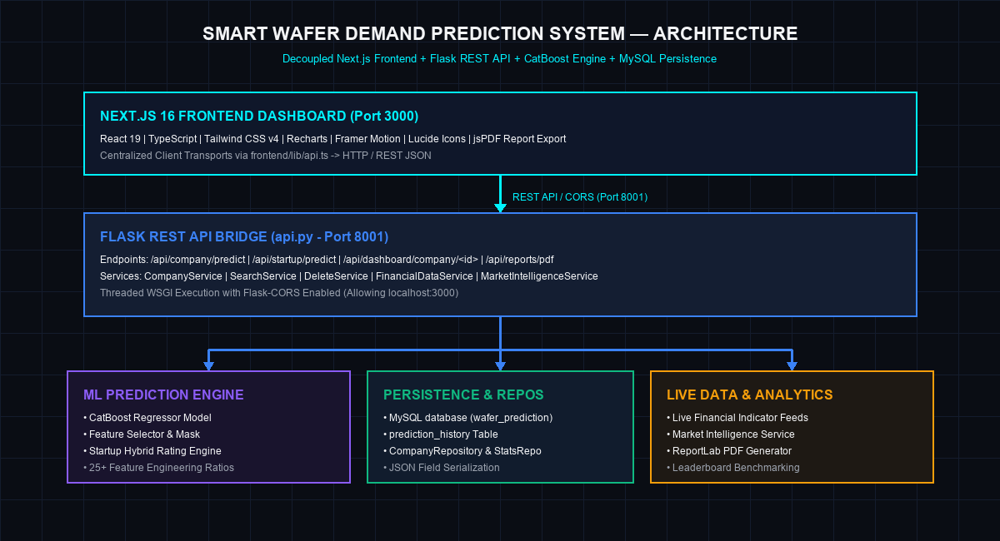

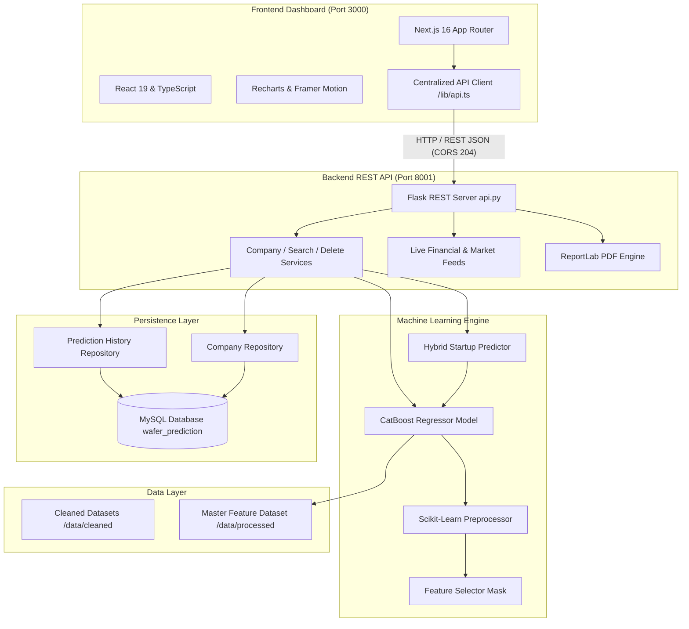

---

## 🔄 Animated System Workflow

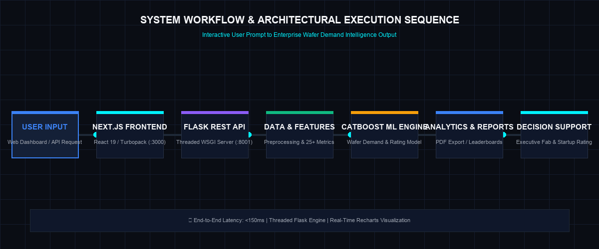

The operational flow follows a structured execution sequence:
1. **User Request**: User selects an existing company or inputs startup parameters on the Next.js UI.
2. **API Transport**: The frontend sends structured JSON to Flask REST API endpoints via preflight-enabled CORS.
3. **Feature Engineering**: Input parameters are enriched into 25+ mathematical ratios (e.g., R&D-to-revenue ratio, price volatility, export risk score).
4. **ML Inference**: The preprocessed vector is filtered through the feature selector mask and passed to the CatBoost Regressor.
5. **Analytics & Persistence**: Predictions are benchmarked against top-tier industry peers and persisted to MySQL.
6. **Decision Support**: Interactive visualizations and downloadable PDF reports are rendered instantly.

---

## ✨ Core Platform Capabilities

| Capability | Description | API Route | Frontend Route |
| :--- | :--- | :--- | :--- |
| **Company Discovery** | Global search across existing fabs and semiconductor companies with node specs | `GET/POST /api/company/search` | `/predict/search` |
| **Existing Company Predictor** | CatBoost ML model predicting monthly wafer starts (3nm–28nm) with confidence bounds | `POST /api/company/predict` | `/predict/company` |
| **Startup Rating Engine** | Hybrid AI + Business logic evaluating early-stage ventures with investment ratings | `POST /api/startup/predict` | `/predict/startup/input` |
| **Company Dashboard** | Historical revenue trends, wafer capacity metrics, and benchmarking scatter plots | `GET /api/dashboard/company/<id>` | `/predict/dashboard` |
| **Prediction History** | Historical prediction log management with search, filter, and deletion | `GET /api/predictions/history` | `/predict/history` |
| **Side-by-Side Comparison** | Comparative delta analysis across two saved prediction scenarios | `POST /api/predictions/compare` | `/predict/compare` |
| **Market Intelligence** | Live financial indicators, industry growth drivers, and market trend feeds | `GET /api/market-intelligence` | Direct Dashboard Feeds |
| **Executive PDF Export** | Downloadable PDF analyst reports with executive summaries and gap analysis | `POST /api/reports/pdf` | PDF Trigger Buttons |

---

## 🤖 Machine Learning & Feature Engineering Pipeline

The prediction core relies on a **CatBoost Regressor** model trained on processed semiconductor industry data.

```text
Raw Datasets ──► Data Cleaning ──► Missing Value Imputation ──► Feature Engineering (25+ Ratios) ──► Feature Selection Mask ──► CatBoost Model ──► Monthly Wafer Demand
```

### **Engineered Domain Features (`src/feature_engineering.py`)**

- **Financial Ratios**:
  - `rd_ratio` = $\frac{\text{R\&D Spend}}{\text{Revenue} + 10^{-6}}$
  - `capex_ratio` = $\frac{\text{CapEx}}{\text{Revenue} + 10^{-6}}$
  - `growth_potential` = $\text{rd\_ratio} \times \text{capex\_ratio} \times 100$

- **Hardware & Chip Performance Metrics**:
  - `performance_score` = $\text{FP16 TFLOPS} \times \text{Memory (GB)}$
  - `performance_per_watt` = $\frac{\text{FP16 TFLOPS}}{\text{TDP (W)} + 1}$
  - `price_volatility` = $\frac{\text{Highest Price} - \text{Lowest Price}}{\text{Avg Price} + 1}$

- **Geopolitical & Export Risk**:
  - `export_risk_score` = $\text{Export Control Events} \times \text{Avg Severity Score}$
  - `geo_risk` = $\text{Export Control Events} + \text{Avg Severity Score}$

- **Innovation & Market Traction**:
  - `innovation_score` = $\text{rd\_ratio} \times \text{AI Chip Launches} \times 100$
  - `ai_market_score` = $\frac{\text{AI Shipments} \times \text{FP16 TFLOPS}}{1,000,000}$

---

## 📊 Multi-Source Datasets & Data Integration

The system ingests and unifies 6 core datasets located under `data/raw/` and `data/cleaned/`:

| Dataset Name | File Path | Contribution / Key Attributes |
| :--- | :--- | :--- |
| **WSTS Billings** | `data/cleaned/wsts_monthly_cleaned.csv` | Historical monthly worldwide semiconductor billings by region |
| **Fab Capacity** | `data/cleaned/fab_capacity_cleaned.csv` | Monthly wafer capacity, process node (nm), fab started year, fab age |
| **Chip Companies Financials** | `data/cleaned/chip_companies_financials_cleaned.csv` | Revenue (USD Bn), R&D spend, CapEx, operating margin % |
| **AI Chip Market** | `data/cleaned/ai_chip_market_cleaned.csv` | Total AI chip shipments, AI revenue ($M), hardware specs (TFLOPS, Memory, TDP) |
| **Chip Prices** | `data/cleaned/chip_prices_cleaned.csv` | Average chip price, highest price, lowest price, price spread |
| **Export Controls** | `data/cleaned/export_controls_cleaned.csv` | Export control restriction events and severity risk scores |

---

## 🌊 Animated Data-Flow Pipeline

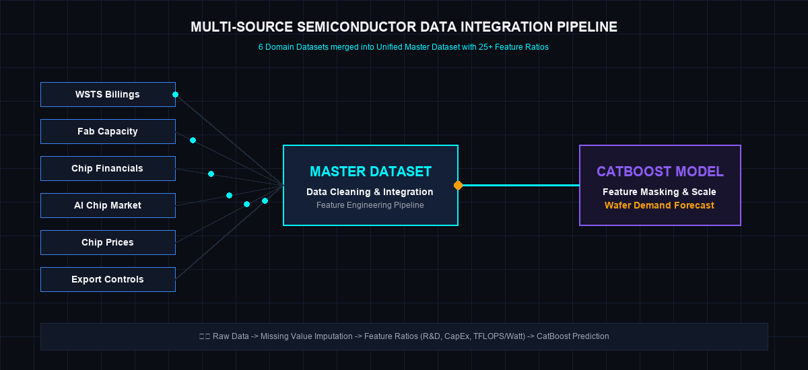

---

## 💻 Frontend Dashboard Architecture

The UI is built with **Next.js 16 (App Router)**, **React 19**, **TypeScript**, and **Tailwind CSS v4**.

### **Key Dashboard Pages**
- **`/app/page.tsx`**: Landing page featuring floating ambient background glows, Hero banner, and platform overview.
- **`/app/predict/company/page.tsx`**: Existing company wafer demand prediction console.
- **`/app/predict/startup/input/page.tsx`**: Interactive startup evaluation wizard (Revenue, R&D, CapEx, FP16 TFLOPS, TDP, Chip Price).
- **`/app/predict/startup/result/page.tsx`**: Hybrid startup rating dashboard displaying AI vs. Business demand scores and investment ratings.
- **`/app/predict/dashboard/page.tsx`**: Comprehensive company analytics dashboard with Recharts scatter visualizations.
- **`/app/predict/history/page.tsx`**: Saved prediction logs with real-time MySQL synchronization.
- **`/app/predict/compare/page.tsx`**: Side-by-side comparative analysis workspace.

---

## 📡 Backend REST API Reference

The Flask REST API (`api.py`) runs on port **8001** and handles preflight CORS requests (`HTTP 204`).

| Method | Endpoint Path | Description | Payload / Query Parameters |
| :--- | :--- | :--- | :--- |
| `GET` | `/api/health` | Backend status & health check | None |
| `GET/POST` | `/api/company/search` | Search companies in DB and dataset | `?query=<term>` |
| `POST` | `/api/company/lookup` | Lookup company operational attributes | `{"company": "TSMC"}` |
| `POST` | `/api/company/predict` | Run CatBoost ML wafer demand prediction | `{"company": {...}}` |
| `POST` | `/api/company/save` | Persist company prediction to database | `{"prediction_name": "...", "predicted_wafers": 150000}` |
| `GET/POST` | `/api/startups/search` | Check if startup exists in database | `?name=<startup_name>` |
| `POST` | `/api/startup/create` | Register new startup record | `{"company": "StartupX", "country": "USA"}` |
| `POST` | `/api/startup/predict` | Execute hybrid startup ML & rating model | `{"company": "...", "expected_revenue": 0.5, ...}` |
| `POST` | `/api/startup/save` | Save startup prediction record | `{"startup": {...}, "prediction": {...}}` |
| `GET` | `/api/dashboard/company/<id>` | Fetch statistics, trends & benchmarking | `company_id` path param |
| `GET` | `/api/predictions/history` | Retrieve all saved prediction logs | None |
| `GET` | `/api/predictions/<id>` | Retrieve single prediction details | `prediction_id` path param |
| `DELETE` | `/api/predictions/<id>` | Delete prediction record from MySQL | `prediction_id` path param |
| `POST` | `/api/predictions/compare` | Compare two predictions side-by-side | `{"prediction_ids": [1, 2]}` |
| `GET` | `/api/financial/<company>` | Retrieve live financial indicators | `company_name` path param |
| `GET` | `/api/market-intelligence` | Retrieve semiconductor market feeds | None |
| `POST` | `/api/reports/pdf` | Stream downloadable PDF report | `{"entity_name": "...", "prediction_result": {...}}` |
| `GET` | `/api/dataset/scatter` | Retrieve scatter metrics for charts | None |

---

## 🛠 Technology Stack Architecture

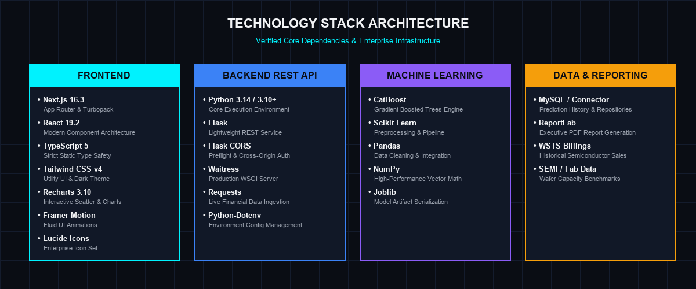

---

## 📁 Project Directory Structure

```text
Smart_Wafer_Demand_Prediction/
├── api.py                           # Flask REST API server (Port 8001)
├── main.py                          # CLI entry point for prediction models
├── config.py                        # Core system configuration
├── requirements.txt                 # Backend Python dependencies
├── package.json                     # Root npm configuration
├── .env.example                     # Environment template
├── src/                             # Machine Learning & Business Logic
│   ├── predictor.py                 # CatBoost Existing Company Predictor
│   ├── dataset_repository.py        # Dataset lookup & caching service
│   ├── feature_engineering.py       # Domain metric engineering pipeline
│   ├── data_cleaning.py             # WSTS & dataset cleaning script
│   ├── company_prediction.py        # Existing company pipeline runner
│   ├── startup_prediction.py        # Startup pipeline runner
│   ├── startup/                     # Hybrid Startup Prediction Engine
│   │   ├── startup_predict.py       # Dual-engine StartupPredictor class
│   │   ├── business_engine.py       # Domain business calculation rules
│   │   ├── confidence_engine.py     # Confidence score calculation
│   │   ├── explanation_engine.py    # Prediction explanation generator
│   │   ├── recommendations.py       # Strategic recommendation engine
│   │   └── startup_classifier.py    # Investment rating & stage classifier
│   ├── services/                    # Application services (Company, Search, Delete)
│   ├── analytics/                   # Leaderboard benchmarking & PDF export
│   │   ├── benchmark.py             # Peers benchmarking math
│   │   └── pdf_report.py            # ReportLab PDF generator
│   └── live_data/                   # Live financial & market services
│       ├── financial_data_service.py
│       └── semiconductor_market_service.py
├── database/                        # Database Repositories
│   ├── db.py                        # MySQL connection setup
│   ├── company_repository.py        # Company DB CRUD
│   ├── prediction_repository.py     # Prediction history DB CRUD
│   ├── startup_repository.py        # Startup DB repository
│   └── statistics_repository.py     # Dashboard trend & stat calculations
├── models/                          # Trained Model Artifacts
│   ├── catboost_model.pkl           # CatBoost Regressor
│   ├── preprocessor.pkl             # Scikit-learn ColumnTransformer
│   ├── selected_mask.pkl            # Feature selection boolean mask
│   └── raw_feature_columns.pkl      # Training feature column names
├── data/                            # Raw & Processed CSV Datasets
│   ├── raw/                         # Source datasets (Excel/CSV)
│   ├── cleaned/                     # Standardized CSV files
│   └── processed/                   # Master feature dataset
├── docs/                            # Documentation Assets
│   └── assets/                      # Infographics, architecture & module diagrams
└── frontend/                        # Next.js 16 Web Dashboard
    ├── app/                         # App Router pages
    │   ├── page.tsx                 # Landing page
    │   └── predict/                 # Prediction workspace routes
    ├── components/                  # UI Components (Cards, Buttons, Navbar, Footer)
    ├── lib/                         # Centralized API transport (api.ts)
    └── package.json                 # Frontend npm dependencies
```

---

## ⚙️ Installation & Setup Guide

### **Prerequisites**
- **Python 3.10+** (Tested up to Python 3.14)
- **Node.js 18+** & `npm`
- **MySQL Database Server** (Optional: local fallback mode supported)

---

### **1. Backend Setup**

1. Open PowerShell or Terminal in the root directory:
   ```powershell
   cd "Smart_Wafer_Demand_Prediction"
   ```

2. Create and activate a Python virtual environment:
   ```powershell
   python -m venv .venv
   .\.venv\Scripts\Activate.ps1
   ```
   *(On Linux/macOS: `source .venv/bin/activate`)*

3. Install required Python packages:
   ```powershell
   pip install -r requirements.txt
   ```

---

### **2. Frontend Setup**

1. Navigate to the `frontend` directory:
   ```powershell
   cd frontend
   ```

2. Install npm dependencies:
   ```bash
   npm install
   ```

---

## 🔑 Environment Configuration

Create or configure `.env` in the root directory and `.env.local` inside `frontend/`:

### **Backend `.env` (Project Root)**
```env
PORT=8001
NEXT_PUBLIC_API_URL=http://127.0.0.1:8001

# MySQL Database Configuration
DATABASE_HOST=127.0.0.1
DATABASE_PORT=3306
DATABASE_USER=root
DATABASE_PASSWORD=your_password
DATABASE_NAME=wafer_prediction

# Optional Live Data API Keys
FINANCIAL_API_KEY=
SEMICONDUCTOR_DATA_API_KEY=
```

### **Frontend `.env.local` (`frontend/.env.local`)**
```env
NEXT_PUBLIC_API_URL=http://127.0.0.1:8001
```

---

## 🚀 Running the Complete System

### **Step 1: Start the Flask Backend API (Port 8001)**
From the root directory:
```powershell
python api.py
```
*Expected Terminal Output:*
```text
[INIT] Initializing Flask app...
🚀 Starting Smart Wafer Demand Prediction REST API Server on port 8001...
```

### **Step 2: Start the Next.js Frontend (Port 3000)**
In a separate terminal, navigate to `frontend`:
```powershell
cd frontend
npm run dev
```
*Access the Web Application at:* **`http://localhost:3000`**

---

## 🔍 API Health Verification

Verify that the REST API backend is running properly:

```powershell
curl.exe http://127.0.0.1:8001/api/health
```

### **Expected JSON Response:**
```json
{
  "success": true,
  "status": "healthy",
  "message": "Smart Wafer Demand Intelligence API is running",
  "timestamp": "2026-09-16 11:10:00"
}
```

---

## 📌 Important Technical Notes & Control Flow

1. **Preflight CORS Handling**: `api.py` utilizes `Flask-CORS` configured to accept requests from origins `http://localhost:3000` and `http://127.0.0.1:3000`. HTTP `OPTIONS` requests return `HTTP 204 No Content`.
2. **Hybrid Startup Weighting Formula**:
   $$\text{Final Startup Prediction} = w_{ai} \times \text{AI Prediction} + w_{bus} \times \text{Business Prediction}$$
   - Revenue $< \$100M$: $w_{ai} = 0.20, w_{bus} = 0.80$ (Emphasizes business fundamentals)
   - Revenue $\$100M - \$1B$: $w_{ai} = 0.40, w_{bus} = 0.60$
   - Revenue $> \$1B$: $w_{ai} = 0.60, w_{bus} = 0.40$ (Emphasizes ML feature scaling)
3. **Fail-Safe Client Transport**: `frontend/lib/api.ts` includes an explicit 5-second fetch timeout with structured 503 fallback responses if the Flask backend server is offline.

---

## 🔬 Research & Engineering Contribution

This project introduces a unified AI framework bridging quantitative financial indicators with physical semiconductor fabrication parameters. Key contributions include:
- **Domain-Specific Feature Synthesis**: Formulating non-linear metric ratios combining hardware computing capability (FP16 TFLOPS/Watt) with macroeconomic geopolitical risk scores.
- **Dual-Engine Startup Evaluation**: Solves the data-scarcity cold-start problem for early-stage chip startups through dynamic hybrid weighting of gradient boosted trees and hardware production business rules.
- **Real-Time Automated Report Synthesis**: Generates full executive analyst reports with competitive gap statements directly from live model predictions.

---

## 🗺 Product Roadmap

- [x] **CatBoost Regressor Core Model** (3nm to 28nm Wafer Demand)
- [x] **Dual-Engine Startup Rating System** (Investment Rating `A+` to `C-`)
- [x] **Next.js 16 Dashboard Interface** with Framer Motion & Recharts
- [x] **MySQL Database Persistence** with JSON prediction history serialization
- [x] **Automated ReportLab Executive PDF Report Export**
- [x] **Live Financial Indicators & Market Intelligence Ingestion**
- [ ] **Multi-Region Fab Supply-Chain Bottleneck Simulator** (Planned)
- [ ] **EUV Lithography Tool Availability Feature Feed** (Planned)

---

## 🖼 Platform Visual Modules & UI Previews

<div align="center">

| Company Discovery | Existing Company Prediction |
| :---: | :---: |
| 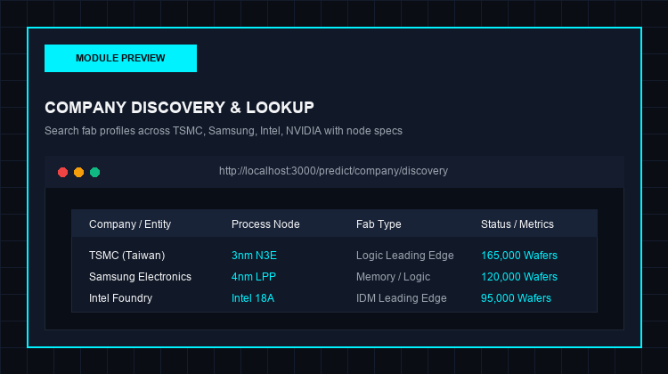 | 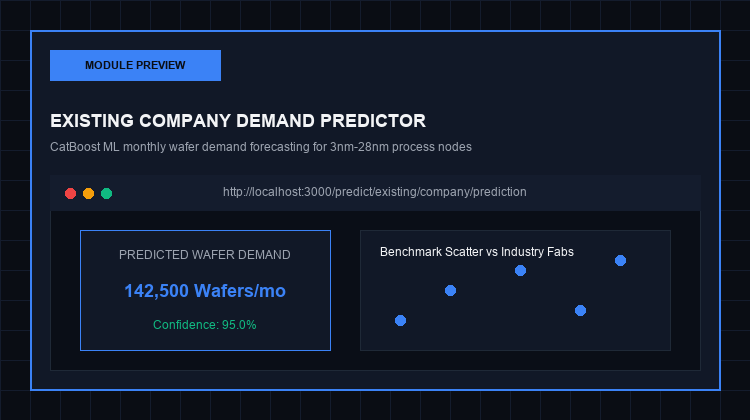 |

| Startup Rating Engine | Dashboard Analytics |
| :---: | :---: |
| 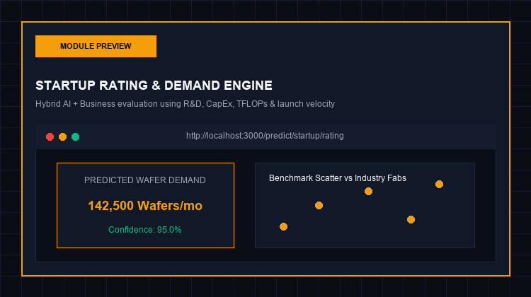 | 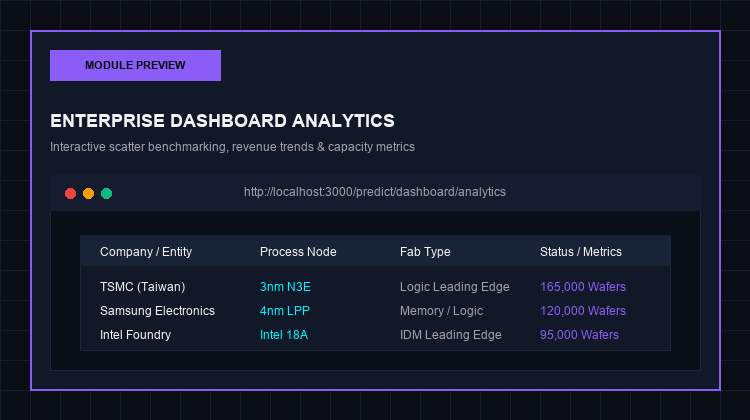 |

| Prediction History | Side-by-Side Comparison |
| :---: | :---: |
| 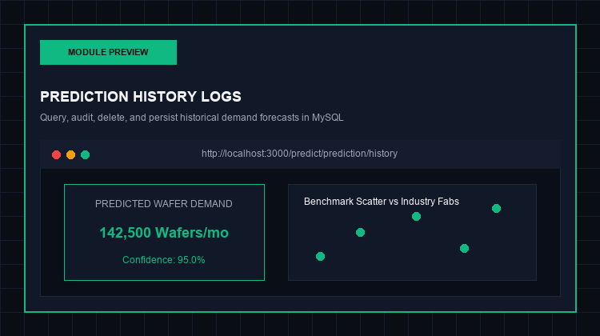 | 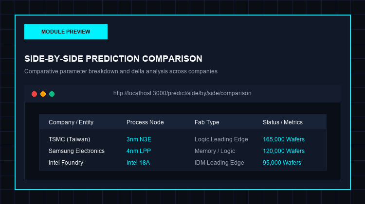 |

</div>

---

## 📜 License & Project Status

This repository is maintained for research, enterprise analytics demonstration, and academic evaluation.

- **Project Status**: Active / Production-Ready Architecture
- **License**: Internal Enterprise & Academic Research License

<div align="center">
  <sub>Smart Wafer Demand Prediction System — Built with Python, CatBoost, Flask, Next.js, and TypeScript.</sub>
</div>
